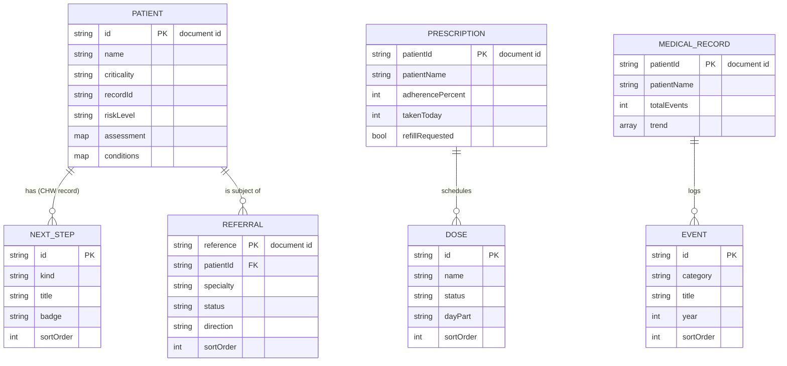

# Firestore Data Model — Patient, Doctor & CHW Screens

This document describes the Firestore structure behind the screens in this
slice (medications, referrals, patient timeline, CHW health record) and the
security rules that protect them. It is kept in step with the actual
collections written by the app's data sources, so the ERD matches the
implementation.

## Entity–Relationship Diagram

## Collections

| Path | Purpose | Screen |
|------|---------|--------|
| `users/{uid}` | Auth profile: email, displayName, role (`patient`/`chw`/`doctor`) | AUTH |
| `prescriptions/{patientId}` | Dose summary, adherence, refill reminder | PAT-03 |
| `prescriptions/{patientId}/doses/{doseId}` | One scheduled dose | PAT-03 |
| `referrals/{reference}` | A referral, tagged with `patientId` | DOC-06 |
| `medical_records/{patientId}` | Timeline header, trend series, AI note | DOC-04 |
| `medical_records/{patientId}/events/{eventId}` | One timeline event | DOC-04 |
| `patients/{patientId}` | Patient identity + CHW health record | DOC-06, CHW |
| `patients/{patientId}/next_steps/{stepId}` | A pending CHW action | CHW |

## CRUD coverage

| Operation | Where |
|-----------|-------|
| **Create** | New referral (`referrals/{reference}`) |
| **Read** | Every screen loads its documents on open |
| **Update** | Mark dose taken / request refill (PAT-03); accept/decline referral (DOC-06) |
| **Delete** | Withdraw referral (DOC-06); complete a next step (CHW) |

The demo patient's data is seeded into Firestore on first read, so a fresh
project is immediately usable; all subsequent interactions read and write the
live documents.

## Security rules

See `firestore.rules`. The model is **deny-by-default**:

- Every read and write requires an authenticated user (`request.auth != null`),
  so an unauthenticated client cannot touch any document.
- `users/{userId}` is readable/writable **only** by that same authenticated UID.
  Register and first login create this document with `role`.
- Creating a referral is validated to carry its required fields
  (`patientId`, `specialty`, `status`, `direction`), preventing malformed
  documents.
- An `ownsResource()` helper is in place to scope reads to a document's owner
  via an `ownerId` field; shared demo records omit `ownerId` so any signed-in
  user can read them.
- A trailing `match /{document=**} { allow read, write: if false; }` denies
  everything not explicitly allowed.

## Known limitations & future work

- **Owner-level scoping** is prepared (`ownsResource()`) but not yet enforced,
  because the authenticated-user/role model is owned by a separate part of the
  team; once records carry `ownerId`, the reads tighten to the owner with no
  data-layer changes.
- The demo operates on fixed patient documents until the patient-selection /
  authentication flow lands.
